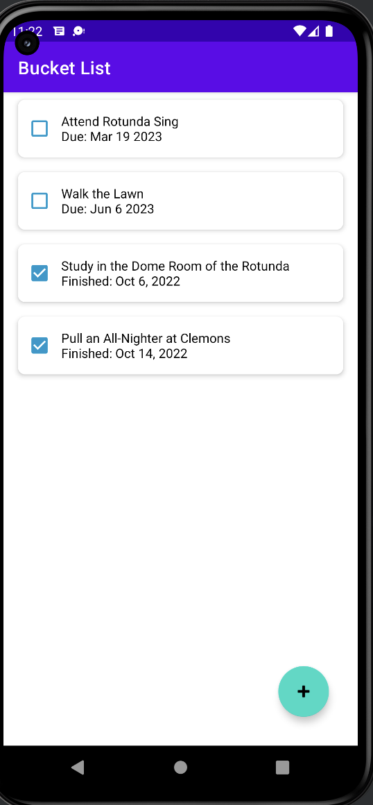
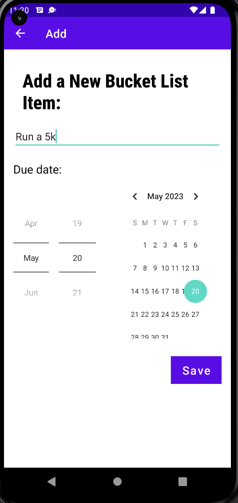
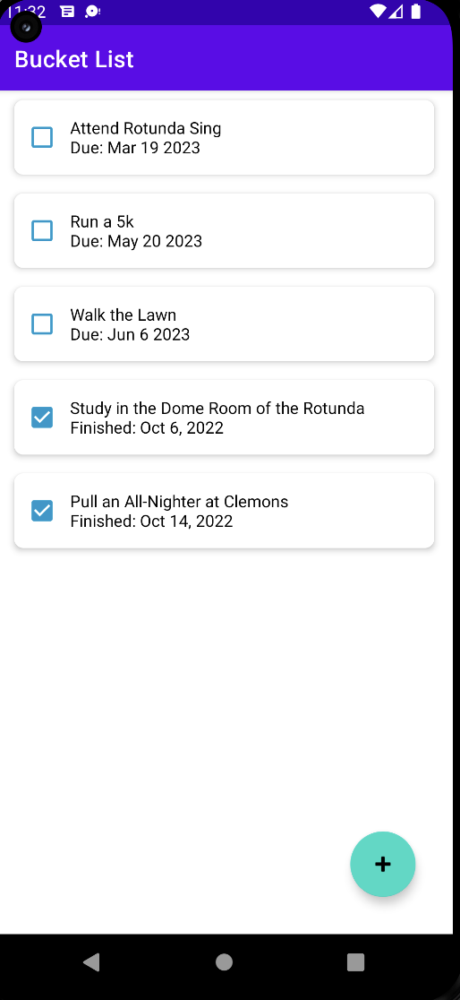
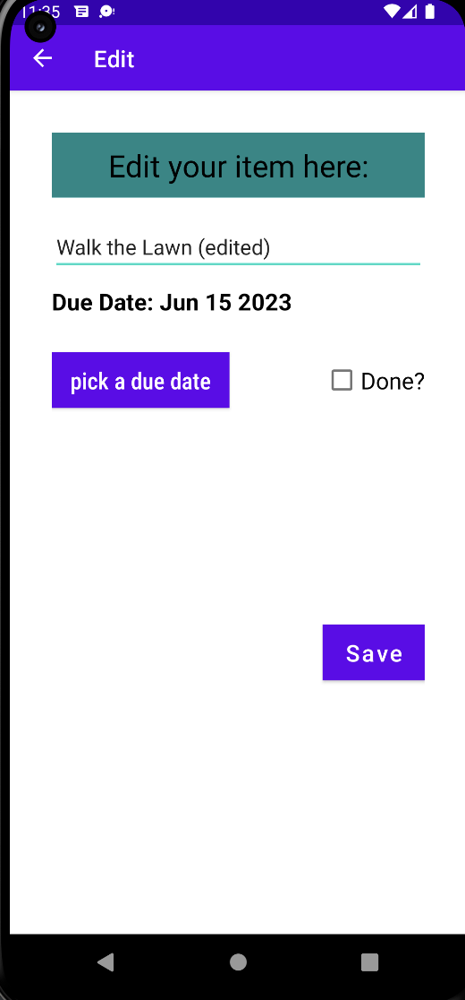
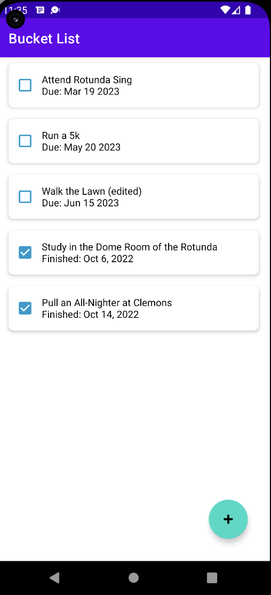

# Bucket/Todo list Android App Written in Kotlin.

## Users use this app to add items to their bucket list of things. Each bucket list item has a name, due date, check box, and possibly a finish date (if done). 

## The items in the list are in order from soonest due date to latest, with the completed ones at the bottom.

Below is an example of the main activity page of the app.

### There is an add button floating at the bottom right of the screen, upon clicking which will take the user to a new screen to add a new bucket list.

The newly added item is automatically sorted in order and displayed along with other ones on the main activity screen.

### Clicking on each item (not the checkbox) will open up an edit activity screen, allowing the user to change the details of the corresponding item.

The edited item is shown in the list, reordered if necessary. 

 
